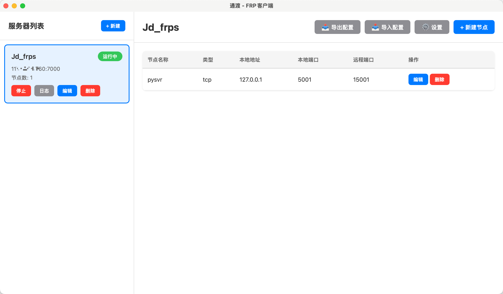

# 通渡 (FRPC Light)

<div align="center">

一个轻量级、现代化的 FRPC 客户端管理工具

[English](./README_EN.md) | 简体中文

[](https://opensource.org/licenses/MIT)
[](https://tauri.app/)
[](https://react.dev/)



</div>

## 📸 应用截图

<table>
  <tr>
    <td></td>
    <td></td>
  </tr>
  <tr>
    <td align="center">服务器列表管理</td>
    <td align="center">节点配置界面</td>
  </tr>
  <tr>
    <td></td>
    <td></td>
  </tr>
  <tr>
    <td align="center">实时日志查看</td>
    <td align="center">设置与关于</td>
  </tr>
</table>

## ✨ 功能特性

- 🚀 **轻量高效** - 基于 Tauri 2.0，资源占用少，启动速度快
- 🎨 **现代化界面** - React 19 + TypeScript 开发，界面简洁美观
- 📋 **多服务器管理** - 支持管理多个 FRPC 服务器配置
- 🔧 **可视化配置** - 通过图形界面配置代理节点，无需手写 INI 文件
- 🎯 **实时状态监控** - 实时显示服务器运行状态
- 📊 **日志查看** - 内置日志查看器，方便排查问题
- 💾 **配置导入导出** - 支持配置文件的导入导出，便于备份和迁移
- 🔐 **支持多种协议** - TCP、UDP、HTTP、HTTPS、STCP、SUDP、XTCP

## 📦 安装使用

### 下载安装包

从 [Releases](https://github.com/meetrice/frpc-light/releases) 页面下载适合你系统的安装包：

- **macOS**: `frpc-light_x.x.x_aarch64.dmg` 或 `frpc-light_x.x.x_x64.dmg`
- **Windows**: `frpc-light_x.x.x_x64-setup.exe`
- **Linux**: `frpc-light_x.x.x_amd64.deb` 或 `frpc-light_x.x.x_amd64.AppImage`

### 首次配置

1. 启动应用后，点击右上角 **⚙️ 设置**
2. 点击 **选择 FRPC 路径**，选择你的 `frpc` 可执行文件
   - 如果没有 frpc，可以点击下载链接获取
3. 点击左侧 **+ 新建** 创建服务器配置
4. 填写服务器信息和代理节点配置
5. 点击 **启动** 按钮启动 FRPC 服务

## 🛠️ 开发指南

### 环境要求

- Node.js 18+
- Rust 1.70+
- pnpm / npm / yarn

### 本地开发

```bash
# 克隆项目
git clone https://github.com/meetrice/frpc-light.git
cd frpc-light

# 安装依赖
npm install

# 启动开发服务器
npm run tauri dev

# 构建生产版本
npm run tauri build
```

### 项目结构

```
frpc-light/
├── src/                  # React 前端源码
│   ├── App.tsx          # 主应用组件
│   ├── api.ts           # Tauri API 封装
│   ├── types.ts         # TypeScript 类型定义
│   └── App.css          # 样式文件
├── src-tauri/           # Rust 后端源码
│   ├── src/
│   │   └── lib.rs      # Tauri 命令实现
│   ├── Cargo.toml      # Rust 依赖配置
│   └── tauri.conf.json # Tauri 应用配置
└── package.json         # Node.js 依赖配置
```

## 📝 使用说明

### 创建服务器配置

1. 点击左侧 **+ 新建** 按钮
2. 填写服务器基本信息：
   - 服务器名称
   - 服务器地址
   - 服务器端口
   - 认证令牌（可选）
3. 保存配置

### 添加代理节点

1. 选择一个服务器配置
2. 点击右侧 **+ 新建节点** 按钮
3. 填写节点信息：
   - 节点名称
   - 协议类型（TCP/UDP/HTTP/HTTPS 等）
   - 本地 IP 和端口
   - 远程端口（或自定义域名）
4. 保存节点

### 启动/停止服务

- 点击服务器卡片上的 **启动** 按钮启动服务
- 点击 **停止** 按钮停止服务
- 状态会自动更新为"运行中"或"已停止"

### 查看日志

- 点击服务器卡片上的 **日志** 按钮
- 在弹出的窗口中查看实时日志输出

## 🤝 贡献

欢迎提交 Issue 和 Pull Request！

## 📄 许可证

[MIT License](./LICENSE)

## 👨‍💻 作者

**meetrice**

- GitHub: [@meetrice](https://github.com/meetrice)

## 🙏 致谢

- [fatedier/frp](https://github.com/fatedier/frp) - 优秀的内网穿透工具
- [Tauri](https://tauri.app/) - 现代化的桌面应用框架
- [React](https://react.dev/) - 用于构建用户界面的 JavaScript 库
